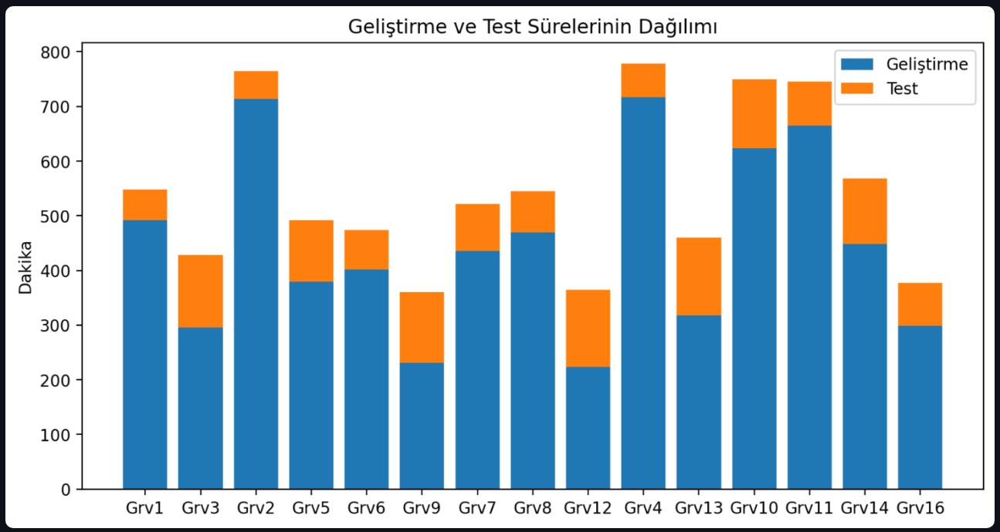
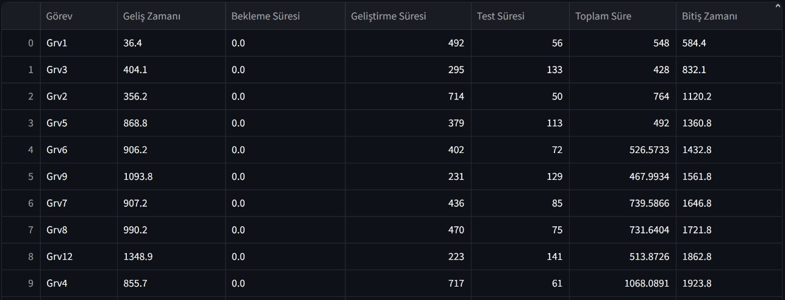

# 🚀 SDCS: Yazılım Geliştirme Süreç Simülasyonu

Bu proje, bir yazılım ekibinin (Developer ve Tester) iş akışını **SimPy** kütüphanesi kullanarak modelleyen bir **Kesikli Olay Benzetimi** çalışmasıdır.

## 🛠️ Teknik Özellikler
* **Motor:** SimPy
* **Arayüz:** Streamlit 
* **Veri Analizi:** Pandas & Matplotlib
* **Modelleme:** Görev gelişleri Üstel Dağılım (Poisson süreci) ile modellenmiştir.

## 🚀 Çalıştırma
1. Bağımlılıkları kurun: `pip install simpy streamlit pandas matplotlib`
2. Arayüzü başlatın: `streamlit run app.py`
3. Alternatif (Terminal): `python main.py`

## 📊 Simülasyon Kapsamı
* **Kaynak Yönetimi:** Yazılımcı ve Test Uzmanı kapasitelerinin bekleme kuyruklarına etkisi.
* **Süreç Takibi:** Geliştirme ve test aşamalarının ayrı ayrı süre analizleri.
* **Performans Metrikleri:** Ortalama tamamlama süresi ve kaynak doluluk oranları.

## Analiz ve Çıkarımlar
  **Senaryo Analizi:**
* Uygulama üzerinden yazılımcı sayısı sabit tutulup test uzmanı sayısı değiştirildiğinde, sistemdeki darboğazın (bottleneck) nasıl yer değiştirdiği gözlemlenebilir. Ortalama bekleme süresindeki değişimler üzerinden "optimum ekip yapısı" maliyet/performans ekseninde analiz edilebilir.

## Görsel Sonuçlar

