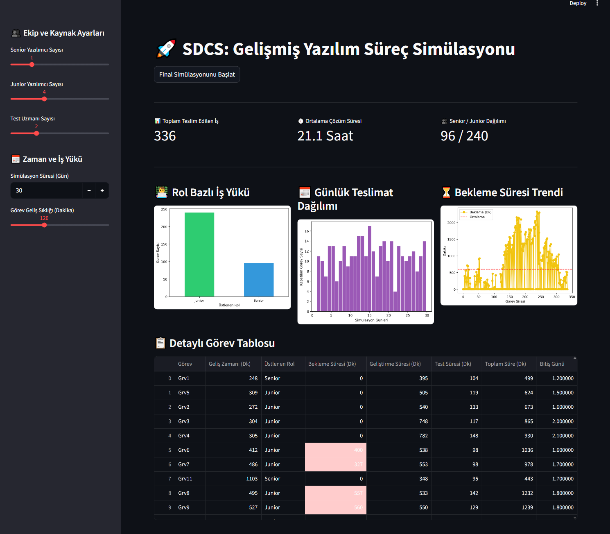

# 🚀 SDCS: Gelişmiş Yazılım Süreç Simülasyonu

Bu proje, bir yazılım organizasyonunun (Senior/Junior Geliştiriciler ve Test Uzmanları) iş akışını **SimPy** kütüphanesi kullanarak modelleyen gelişmiş bir **Kesikli Olay Benzetimi (Discrete Event Simulation)** çalışmasıdır.

Model, düz bir kuyruk yapısının ötesine geçerek gerçek hayattaki yazılım ekiplerinin takvim kısıtlarını, heterojen iş gücü kapasitelerini ve operasyonel kararlarını simüle etmek üzere genişletilmiştir.

## 🛠️ Teknik Özellikler & Gelişmiş Mekanizmalar
* **Motor:** SimPy (Asenkron süreç ve olay yönetimi)
* **Arayüz:** Streamlit (İnteraktif Karar Destek Paneli)
* **Veri Analizi & Görselleştirme:** Pandas & Matplotlib
* **Heterojen Kaynak Yönetimi:** Ekipler homojen değildir. Model, görevleri öncelikle yüksek hızlı **Senior** geliştiricilere atar; kapasite dolduğunda işleri otomatik olarak **Junior** geliştirici havuzuna yönlendirir.
* **Matematiksel Mesai Modellemesi:** Projede yazılımcıların 7/24 çalışmadığı gerçeği kurgulanmıştır. Saf çalışma dakikaları, günlük 8 saatlik efektif mesai matrisine oranlanarak gerçek takvim günlerine dönüştürülür.
* **Olasılıksal Varyans (Stokastik Yapı):** Görev gelişleri Üstel Dağılım (*Exponential Distribution*), çözüm süreleri ise kıdem seviyelerine göre Tekbiçimli Dağılım (*Uniform Distribution*) ile modellenmiştir. `seed` kısıtı kaldırılarak her çalıştırmada benzersiz senaryolar üretilmesi sağlanmıştır.

## 🚀 Çalıştırma ve Kurulum
1. Gerekli tüm kütüphaneleri yükleyin:
   ```bash
   pip install simpy streamlit pandas matplotlib
2. Streamlit arayüzünü başlatın:
   ```bash
   streamlit run app.py
3. Sadece terminal çıktısı için
   ```bash
   python main.py

## 📊 Simülasyon Kapsamı ve Dashboard İçeriği
Uygulama çalıştırıldığında anlık olarak şu analiz araçlarını sunar:

* **Metrik Kutuları:** Toplam Teslim Edilen İş, Ortalama Çözüm Süresi (Saat bazında) ve Senior/Junior iş yükü dağılım oranları.

* **👨‍💻 Rol Bazlı İş Yükü Grafiği:** Kıdem rollerinin üstlendiği toplam görev adetlerinin kıyaslanması.

* **📅 Günlük Teslimat Dağılımı:** Simülasyon günleri boyunca hangi gün kaç adet görevin başarıyla kapatıldığını gösteren histogram.

* **⏳ Bekleme Süresi Trendi:** Görevlerin kuyrukta harcadığı sürelerin zaman serisi analizi (Sistemin darboğaza girdiği anların tespiti).

* **📋 Detaylı Görev Tablosu:** Kuyrukta bekleyen (bekleme süresi > 0) görevleri otomatik olarak kırmızı renkle vurgulayan dinamik veri tablosu.

## 📸 Uygulama Ekran Görüntüsü

